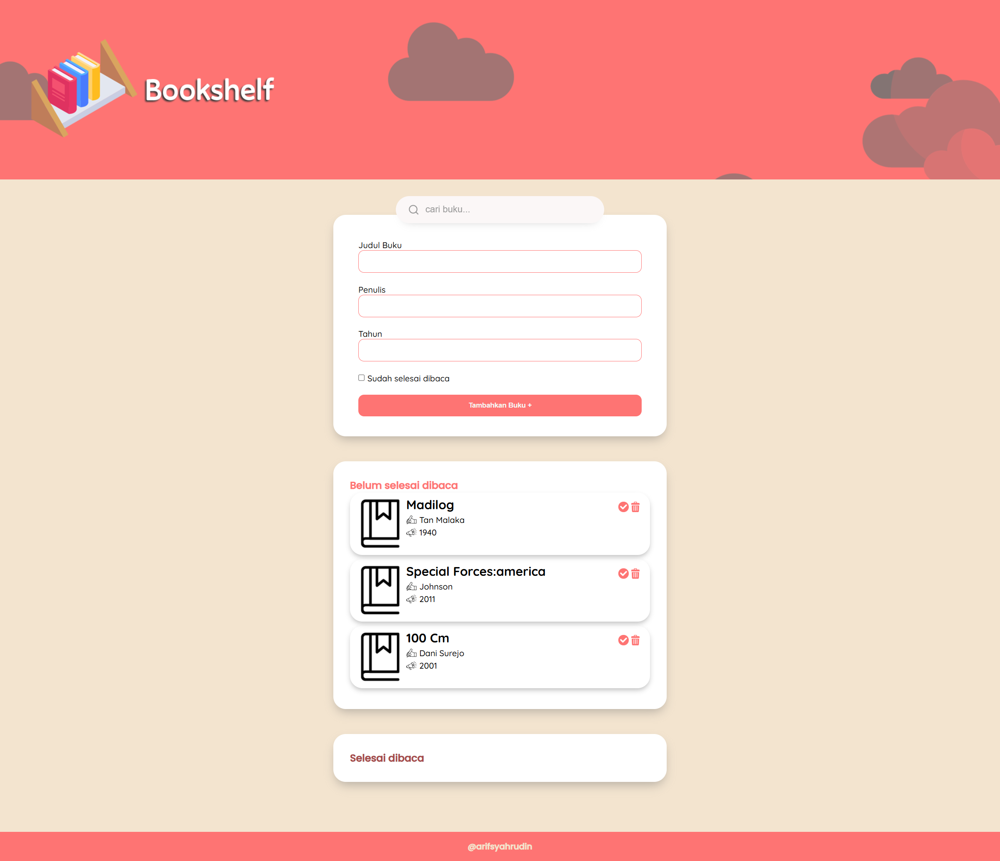
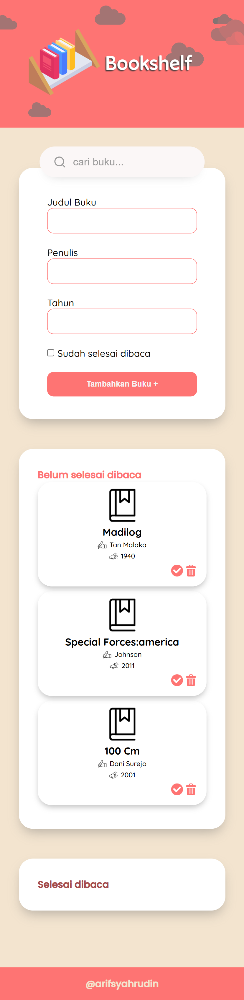

# Bookshelf Web App

This project is my **final submission** for the Dicoding course *Belajar Membuat Front-End Web untuk Pemula*.  
The application allows users to manage their reading list by adding books, moving them between shelves, and deleting them.  

---

## Introduction
The **Bookshelf Web App** is a simple front-end application that helps users organize their books into two categories:  
- **Unread (Belum selesai dibaca)**  
- **Read (Selesai dibaca)**  

This project is built using **HTML, CSS, and JavaScript**, with `localStorage` as data persistence.  

---

## Features

### Save Content with `localStorage`
- Book data is saved in the browser using `localStorage`, so it remains available even after closing the page.  

### Add New Books
- Add new books through a form.  
- Unique ID is automatically generated.  
- Inputs include: title, author, year, and reading status.  

### Two Shelves
- **Unread Shelf** → contains unfinished books.  
- **Read Shelf** → contains finished books.  

### Move Books Between Shelves
- Books can be moved between **Unread** and **Read** shelves.  
- Changes are also updated in `localStorage`.  

### Delete Books
- Remove books from shelves.  
- The data will also be deleted from `localStorage`.  

---

## Additional Features
- Search bar to filter books.  
- Responsive design (mobile & desktop).    
- Custom book cover icon.  

---

## Preview


<p align="center">
  
</p>

---
## How to Run the Project
1. Clone this repository:
   ```bash
   git clone https://github.com/your-username/bookshelf-app.git

2. Open the project folder
   ```bash
   cd bookshelf-app
3. Open **index.html** in your browser (no server needed).
